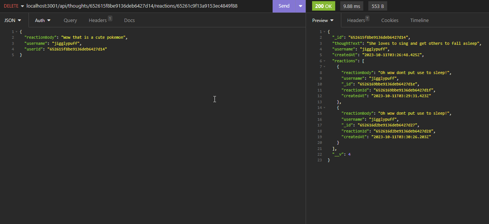

# Social-Network-API

## Link to application 
https://github.com/Seanye333/Social-Network-API

## Video Tutorial 
https://watch.screencastify.com/v/uXJgpHbmc1fmgR6GIk1O

## Description

MongoDB is a popular choice for many social networks due to its speed with large amounts of data and flexibility with unstructured data. The task is to build an API for a social network web application where users can share their thoughts, react to friends’ thoughts, and create a friend list. Express.js for routing, a MongoDB database, and the Mongoose ODM. In addition to using the [Express.js](https://www.npmjs.com/package/express) and [Mongoose](https://www.npmjs.com/package/mongoose) packages are used. 

You can create your own data using Insomnia after you’ve created your API by using this repo!



## Installation
To install this project within your computer, please follow the instruction below
1. Open git bash
2. Create your own file
3. To clone the repository: type in git clone https://github.com/Seanye333/Social-Network-API
4. Direct to the file path on terminal 
5. Input "npm i" to install packages
6. Run with "npm start"
7. Create, Read, Update, Delete your API inputs from insomina 


## Usage
Please download the files from my github page and feel free to use it without any cost. 


## Credits
https://www.mongodb.com/docs/compass/current/connect/

## License
This project is licensed under the MIT License.

## Features
Following features are from original acceptance criteria from the project: 
```md
GIVEN a social network API
WHEN I enter the command to invoke the application
THEN my server is started and the Mongoose models are synced to the MongoDB database
WHEN I open API GET routes in Insomnia for users and thoughts
THEN the data for each of these routes is displayed in a formatted JSON
WHEN I test API POST, PUT, and DELETE routes in Insomnia
THEN I am able to successfully create, update, and delete users and thoughts in my database
WHEN I test API POST and DELETE routes in Insomnia
THEN I am able to successfully create and delete reactions to thoughts and add and remove friends to a user’s friend list
```

## How to Contribute
Contributions to this project are not avaiable currently.
